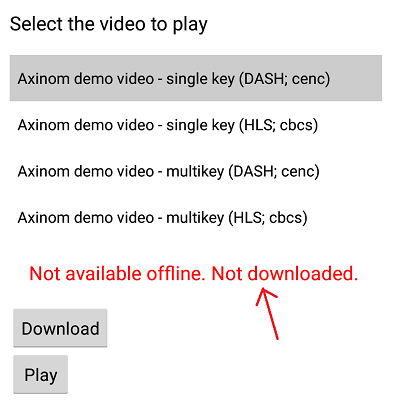

# Axinom DRM Sample Player with offline playback support

This is an Android application that plays back DASH videos protected using Axinom DRM. This app also includes the option to download DASH videos and to play them offline.

# Project structure

This project uses [ExoPlayer](https://github.com/google/ExoPlayer) to playback DASH videos protected using Axinom DRM and is based on the ExoPlayer sample code.  
Also, a library is included in the project named [axlicense.aar](app/libs/axlicense-3.4.19352.1.aar/) which takes care of downloading the licenses, checking their validity, and restoring the licenses for offline playback.

## Important files

[SampleChooserActivity.java](app/src/main/java/com/axinom/drm/sample/activity/SampleChooserActivity.java)

* Loads sample videos from [samplelist.json](app/src/main/assets/samplelist.json).  
This json file can be modified to add your own sample videos for the application to use.  
More information about it in ["Adding sample videos"](#adding-sample-videos) chapter below.
* Gives users the possibility to either play videos online or download the videos and play them offline.  
See ["How to use the application"](#how-to-use-the-application) chapter below for more details.

[DemoPlayer.java](app/src/main/java/com/axinom/drm/sample/player/DemoPlayer.java)

See *buildDrmSessionManager()* method which
* Attaches the license token to license requests.

[AxDownloadService.java](app/src/main/java/com/axinom/drm/sample/offline/AxDownloadService.java)
* A class that extends Exoplayer's DownloadService class. Defines a service that enables the downloads to continue even when the app is in the background.

[AxDownloadTracker.java](app/src/main/java/com/axinom/drm/sample/offline/AxDownloadTracker.java)
* A class that manages the downloads: initializes the download requests, enables to select tracks for downloading, and listens for events where download status changed.

[AxOfflineManager.java](app/src/main/java/com/axinom/drm/sample/offline/AxOfflineManager.java)
* A class that manages the initialization of Exoplayer's DownloadManager and data source factory objects.

## Other major components

ExoPlayer demo application code is in the [player](app/src/main/java/com/axinom/drm/sample/player) package and is largely irrelevant to the functioning of Axinom DRM.

# Device compatibility

This project is compatible with devices running Android 4.4 or newer.

# How to run the application

1. Open Android Studio and connect an Android 4.4 (or newer) device to a computer.
2. Clone or download this repository and open the project in Android Studio.
3. Run the application by selecting *Run -> Run 'app'* from the Android Studio menu bar.

# How to use the application

* Play video from an online source
1. Select video from sample videos list (selected video title is indicated by gray background).
2. Press the "Play" button.

* Play video from an offline source
1. Observe the offline availability status of the selected video. It is a text placed between the video sample list and control buttons:

For the video to be available offline, it has to be both downloaded and have a valid license (indicated by the green text, any issues can be recognized by red text).

2. If the video is available offline, press the "Play offline" button to play it from an offline source.  
The "Play offline" button will appear only if the content is available offline.

3. If the video is not already downloaded, it has to be done by pressing the "Download" button.  
Download feature saves the required license also in addition to downloading the video.  
Download progress can be observed from the text below offline availability status. Progress is also visible on the notifications bar.  
After the download is successfully completed, the "Play offline" button appears and it can be pressed for offline playback.

* Delete the downloaded video
1. Press the "Delete" button. Which also removes the license for the downloaded video.

* Remove only the saved licenses (only available when content is downloaded)
1. For removing license only for the selected video press "Remove license".
2. For removing all saved licenses press "Remove all licenses".

* Request license (only available for a downloaded video that does not have a valid license)
1. For requesting a license for the selected video press "Request license".

## Adding sample videos

In order to add your own sample videos to the application, please add entries to [samplelist.json](app/src/main/assets/samplelist.json).

Keys to provide value for are the following:

**title:** Display name for the sample video.

**videoUrl:** DASH manifest URL.

**licenseServer:** Axinom DRM License Server URL.

**licenseToken:** License Token for License Request.

## Offline mode

It is possible to download both non-protected and DRM-protected videos and play them offline.

The library takes care of downloading the licenses, checking their validity, and restoring the licenses for offline playback.  
To play DRM videos in offline mode, player library needs to save the persistent license keys on the device's internal storage.  
To preserve an offline license, `"allow_persistence": true` flag needs to be present inside the DRM token.

To download licenses, **OfflineLicenseManager** class is used.  
This class contains functionality that is responsible for obtaining licenses and saving licenses' access keys to device internal storage.

In general, the responsibilities of the OfflineLicenseManager class are:
* Downloading a license
* Checking license validity
* Update expired licenses
* Restoring the license for offline playback
* Dispatch completion events which contain information about completion results (success or failure)

In order to be able to download media the following steps should be followed:

Before initializing the AxOfflineManager, the WRITE_EXTERNAL_STORAGE permission must be granted.

Initialize the AxOfflineManager:
<pre><code class="Java">
AxOfflineManager.getInstance().init(context);
</code></pre>
If no download folder path is specified then the default folder (external storage directory) is used.  
It is possible to set a custom folder by initializing the AxOfflineManager by providing the folder path:
<pre><code class="Java">
AxOfflineManager.getInstance().init(context, folder);
</code></pre>

Start the download service:
<pre><code class="Java">
DownloadService.start(this, AxDownloadService.class);
</code></pre>

Initalize the OfflineLicenseManager object and start license download:
<pre><code class="Java">
mOfflineLicenseManager = new OfflineLicenseManager(this);
mOfflineLicenseManager.downloadLicenseWithResult(licenseServerUrl, manifestUrl, drmMessage, true)
</code></pre>

Retrieve DownloadTracker:
<pre><code class="Java">
mAxDownloadTracker = AxOfflineManager.getInstance().getDownloadTracker();
</code></pre>

Initialize DownloadHelper by providing the media (manifest) url and calling prepare():
<pre><code class="Java">
mDownloadHelper = mAxDownloadTracker.getDownloadHelper(uri,this);
mDownloadHelper.prepare(this);
</code></pre>

Implement DownloadHelper.Callback interface and the required onPrepared() and onPreparedError() methods to listen to the DownloadHelper events.  
After the onPrepared() event occurs, download processs can be started by calling the download() method that takes two parameters:  
a description (for example the video title) and a 2-dimensional tracks (representations) array where tracks are defined in the following format: [periodIndex0, rendererIndex0, groupIndex0, trackIndex0, [], ...].  
The format is based on MappedTrackInfo object that contains the mapped track information for each renderer (i.e. video, audio, text, etc.) with the same structure.

If the tracks array is null or empty then all the tracks are downloaded for that media resource.

<pre><code class="Java">
@Override
public void onPrepared(DownloadHelper helper) {
    mAxDownloadTracker.download(title, tracks);
}

@Override
public void onPrepareError(DownloadHelper helper, IOException e) {
    ...
}
</code></pre>
